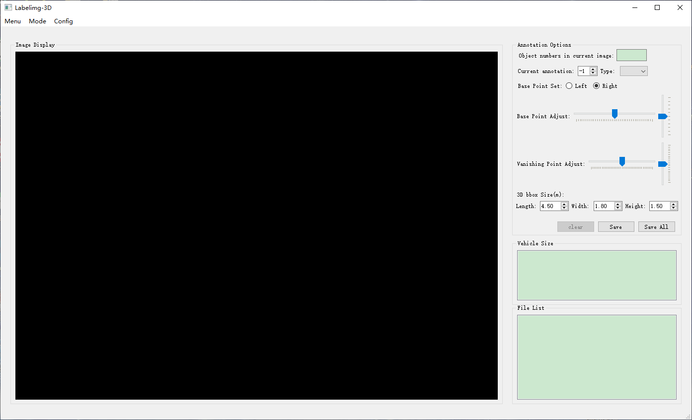

# 3D bbox annotation tools - Tutorial

## Enviroments

|          |                                                              |
| -------- | ------------------------------------------------------------ |
| Operate System | Windows 10 Enterprise                                            |
| Tools     | pycharm(Community Edition 2020.3.2)、Anaconda(5.3.1, python3.7/3.6)、PyQt5 (5.15.2) |
| Libs       | OpenCV 4.4.0、YOLOv4(Darknet)                                |

## Tutorial

### 1. main page:
- menu, image display, annotation options and file list.



### 2. choose annotation folder:
- images in the folder are automatically loaded.


### 3. choose annotation file:
- double-click any row in file list, detection results are generated by yolov4.


### 4. choose annotation object:
- (1) change current annotation to choose annotation object. Types are generated by yolov4, if wrong, you can change to the correct.
- (2) choose base point view.
- (3) adjust base point, vanish point and 3D box dimension to achieve the best fit score.
- (4) click button "save" (shortcut: Ctrl+A) to save single object annotation. click button "clear" to clear saved annotations. repeat (1)--(4) to complete each object annotation.
- (5) click button "save_all" (shortcut: Ctrl+S) to save all object annotations.
- (6) repeat (1)--(5) to complete all image annotations.


## Annotation Format
```
<annotation>
	<filename>absolute path: {image_id}.jpg/png</filename>
	<calibfile>absolute path: {scene_id}.xml</calibfile>
	<size>
		<width>image_width</width>
		<height>image_height</height>
		<depth>image_depth</depth>
	</size>
	<object>
		<type>vehicle type</type>
		<bbox2d>2D bbox: left, top, right, bottom</bbox2d>
		<vertex2d>3D bbox(image): pt1~pt8</vertex2d>
		<veh_size>3D bbox dimension(m)</veh_size>
		<perspective>view: left/right</perspective>
		<base_point>3D bbox base point(image): pt2</base_point>
		<vertex3d>3D bbox(world): pt1~pt8</vertex3d>
		<veh_loc_2d>3D bbox centroid(image)</veh_loc_2d>
	</object>
	<object>
            ...
	</object>
	...
</annotation>
```


- eight points index:

| base point (left) | base point (right) |
| :---------------: | :----------------: |
|  |  |


## Appendix

### Pyinstaller - pack exe file
if you revise the source code and want to generate a new exe file, you can use the following command:

`pyinstaller -F -w -i resource/label3d_3.ico main.py`

## Contaction
if you have any questions and suggestions, please contact: andy19966212@126.com
