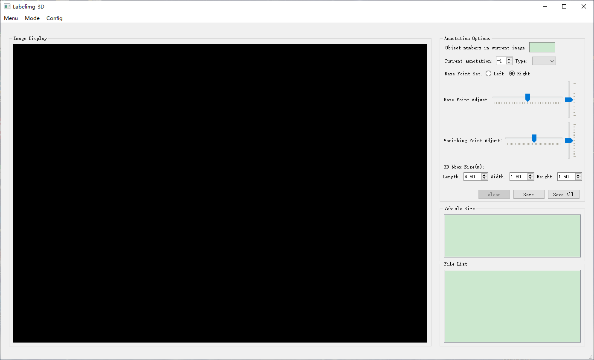

# Labelimg3D
## 3D-BBox-Annotation-Tool

PyQt implementation of 3D bbox annotation tool.



***

### Get Started
- Instruction: [3d_bbox_annotation_instruction.md](3d_bbox_annotation_instruction.md)

- Labelimg3D-V2.0: [Releases(exe)](https://github.com/stjuliet/Labelimg3D/releases/tag/Labelimg3D-V2.0)

- install from source code: [INSTALL.md](INSTALL.md)


### Citation
```
@article{tang2022CenterLoc3D,
  title={CenterLoc3D: Monocular 3D Vehicle Localization Network for Roadside Surveillance Cameras},
  author={Tang, Xinyao and Song, Huansheng and Wang, Wei and Zhao, Chunhui},
  journal={arXiv preprint arXiv:2203.14550},
  year={2022}
}
```
